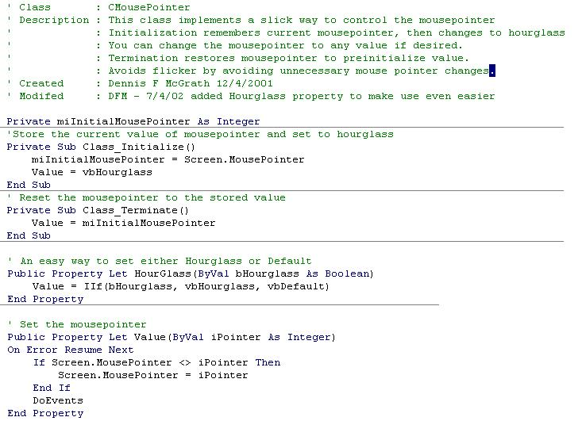



## CMousePointer\.cls

### Description

Greatly simplifies mousepointer control, while at the same time avoiding unnecessary changes (less flicker), and uses DoEvents to assure that the displayed mousepointer changes in a timely manner. -- At the top of any Sub/Function in which you want to control the mousepointer: Dim oMp As CMousePointer -- and -- Set oMp = New CMousepointer -- This will remember the current mousepointer and set the mousepointer to vbHourglass. -- If you actually want to force to vbDefault, as in an error handling Sub/Function, or in cases where you want to set to vbHourglass conditionaly, add: oMp.Houglass = False -- or -- oMp.Value = vbDefault -- You can use the Hourglass or Value properties to change the mousepointer anywhere else in your Function. -- In the exit routine: Set oMp = Nothing --

This will reset the mousepointer to whatever it was on entering the Sub/Function
 
### More Info
 
Two properties to be used on the few occasions where vbHourglass is not the desired mousepointer.

Hourglass: A boolean, False being vbDefault.

Value: Any valid mousepointer value.

             |
---                |---
**Submitted On**   |2002-07-05 13:09:52
**By**             |[Dennis F McGrath](https://github.com/Planet-Source-Code/PSCIndex/blob/master/ByAuthor/dennis-f-mcgrath.md)
**Level**          |Advanced
**User Rating**    |5.0 (10 globes from 2 users)
**Compatibility**  |VB 5\.0, VB 6\.0
**Category**       |[Miscellaneous](https://github.com/Planet-Source-Code/PSCIndex/blob/master/ByCategory/miscellaneous__1-1.md)
**World**          |[Visual Basic](https://github.com/Planet-Source-Code/PSCIndex/blob/master/ByWorld/visual-basic.md)
**Archive File**   |[CMousePoin102475752002\.zip](https://github.com/Planet-Source-Code/dennis-f-mcgrath-cmousepointer-cls__1-36606/archive/master.zip)

